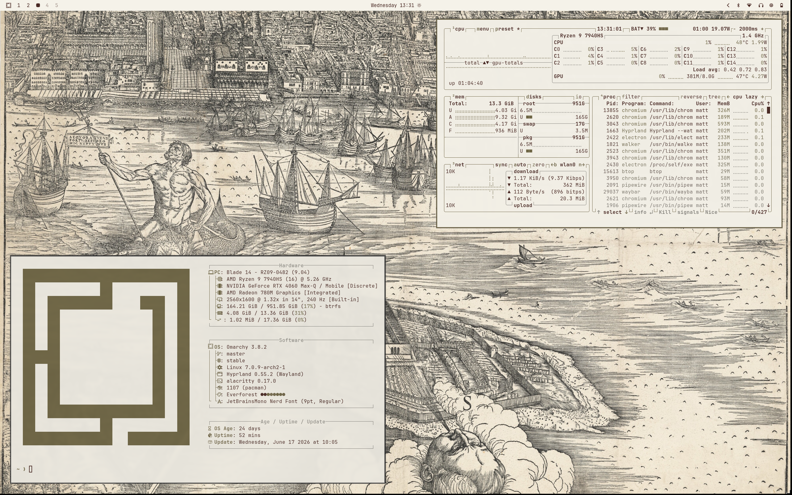

# Omarchy Venice From Above Theme

A light Omarchy theme inspired by Jacopo de' Barbari's monumental View of Venice (1500), bringing parchment tones, aged ink, and Renaissance craftsmanship to your desktop.

    



## Inspiration

Completed around 1500, View of Venice is one of the Renaissance's most remarkable achievements. Long before aerial photography, Jacopo de' Barbari imagined the city from above, mapping its canals, churches, and crowded streets with extraordinary precision.

The palette draws from aged paper, walnut ink, and softened pigments, producing a desktop that feels warm and comfortable for long hours of work.

## Wallpaper Gallery

This theme includes six sections of Jacopo de' Barbari's View of Venice (1500).

| Preview | Artwork |
| ------- | ------- |
|  | View of Venice #1 (1500) |
|  | View of Venice #2 (1500) |
|  | View of Venice #3 (1500) |
|  | View of Venice #4 (1500) |
|  | View of Venice #5 (1500) |
|  | View of Venice #6 (1500) |

## Color Palette


## Components

- Aether
- Alacritty
- btop
- Chromium
- Foot
- Ghostty
- Hyprland
- Kitty
- Neovim
- Omarchy Shell (bar, lock screen, notifications, launcher, on-screen display)
- Vencord
- VS Code
- Warp
- Zellij

## Installation

Clone the repository into your Omarchy themes directory:

```bash
omarchy-theme-install https://github.com/mattbbia/venice-from-above.git
```
### OR

1. Open the Omarchy menu (**Super + Alt + Space**).
2. Go to **Install > Style > Theme**.
3. Paste this repo URL: `https://github.com/mattbbia/venice-from-above.git`
4. Hit Enter.

## Contributing

Contributions, bug reports, feature requests, and suggestions are always welcome. Feel free to open an issue or submit a pull request.

## Support

If you enjoy this theme and would like to support future themes, you can:

- ⭐ Star this repository
- 💡 Suggesting new themes
- ☕ Supporting future themes

[](https://buymeacoffee.com/mattbbia)

## Acknowledgements

All artwork by Jacopo de' Barbari is in the public domain. The high-resolution source images used in this theme were obtained from [National Gallery of Art](https://www.nga.gov/) and are included here for appreciation and preservation of public-domain art.

## License

This project is licensed under the MIT License. See the LICENSE file for details.
